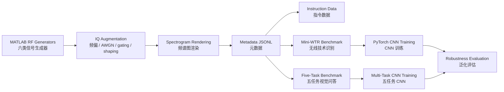

# Mini RF-GPT Reproduction / Mini RF-GPT 小规模复现


## Overview / 项目概览

**EN**: This repository is a small-scale RF-GPT / Mini-WTR reproduction project. It builds a synthetic RF spectrogram data factory in MATLAB, exports instruction-style JSONL datasets, and trains lightweight PyTorch baselines for wireless technology recognition and five-task RF visual QA.

**中文**：本项目是一个小规模 RF-GPT / Mini-WTR 复现工程。它使用 MATLAB 生成合成 RF 波形与频谱图，构建 metadata / instruction JSONL 数据，并使用 PyTorch 训练轻量 CNN baseline，用于无线技术识别与五任务 RF 视觉问答基准。

> **Important / 重要说明**  
> This is a synthetic-data reproduction for research and demonstration. It should not be described as real over-the-air RF capture or real-world deployment validation.  
> 本项目基于合成数据，适合复现实验、方法验证和展示，不应表述为真实空口采集数据或真实部署级泛化验证。

## What This Project Provides / 项目内容

| Icon | Module | English | 中文 |
|---|---|---|---|
| 📡 | RF Generators | 5G NR, LTE, UMTS, WLAN, DVB-S2, Bluetooth waveform generators | 六类无线信号生成器 |
| 🌈 | Spectrograms | STFT-based grayscale RF spectrogram images | 基于 STFT 的 RF 频谱图生成 |
| 🧾 | Metadata | JSONL metadata and instruction-style data | metadata 与 instruction JSONL 构建 |
| 🧪 | Benchmarks | Mini-WTR and six-technology five-task benchmark | Mini-WTR 与六类五任务 benchmark |
| 🧠 | Models | Lightweight PyTorch CNN baselines | 轻量 PyTorch CNN baseline |
| 🧭 | Robustness | Hard-test, robust split, and domain-held-out evaluation | hard-test、robust split、domain-held-out 泛化评估 |
| ☁️ | Kaggle | Kaggle-ready Python training workflow | 可部署到 Kaggle 的训练流程 |

## Pipeline / 复现流程



## Repository Structure / 仓库结构

```text
rf-waveform-mini-rfgpt/
├── generators/                  # MATLAB waveform generators / 六类 RF 波形生成器
│   ├── gen_5g_nr.m
│   ├── gen_lte.m
│   ├── gen_umts.m
│   ├── gen_wlan.m
│   ├── gen_dvbs2.m
│   └── gen_bluetooth.m
├── utils/                       # Signal augmentation and spectrogram utilities
│   ├── add_awgn_custom.m
│   ├── apply_freq_offset.m
│   ├── apply_random_time_gating.m
│   ├── apply_random_frequency_shaping.m
│   ├── apply_technology_visual_profile.m
│   └── make_spectrogram_image.m
├── scripts/                     # Dataset generation, split, audit, benchmark scripts
│   ├── main_generate_all_tech_dataset.m
│   ├── main_generate_hard_test_dataset.m
│   ├── build_robust_wtr_splits.m
│   ├── build_domain_holdout_wtr_splits.m
│   ├── build_sixtech_fivetask_benchmark.m
│   ├── audit_dataset_quality.m
│   └── run_wtr_baseline.m
├── python/                      # PyTorch training and evaluation
│   ├── train_wtr_cnn.py
│   ├── train_fivetask_cnn.py
│   ├── eval_wtr_cnn.py
│   ├── eval_fivetask_predictions.py
│   └── rf_dataset.py
├── docs/                        # Reproduction notes and Kaggle guide
│   ├── REPRODUCTION_SUMMARY.md
│   ├── SIXTECH_FIVETASK_BENCHMARK.md
│   └── KAGGLE_TRAINING.md
├── DATASET_CARD.md
├── run_next_pipeline.m
└── startup.m
```

Generated datasets and outputs are intentionally excluded from Git:

```text
data_all/
data_hard/
data_robust/
data_domain_holdout/
outputs/
```

## Supported Signal Types / 支持的无线信号类型

| Technology | 中文说明 | Generator |
|---|---|---|
| 5G NR | 第五代移动通信新空口 | `generators/gen_5g_nr.m` |
| LTE | 4G LTE 下行参考波形 | `generators/gen_lte.m` |
| UMTS / WCDMA | 3G WCDMA / UMTS | `generators/gen_umts.m` |
| WLAN | Wi-Fi / 802.11 VHT | `generators/gen_wlan.m` |
| DVB-S2 | 卫星通信 DVB-S2 | `generators/gen_dvbs2.m` |
| Bluetooth LE | 蓝牙低功耗信号 | `generators/gen_bluetooth.m` |

## Benchmarks / 数据基准

### 1. Mini-WTR: Wireless Technology Recognition

**EN**: Six-class RF spectrogram classification.  
**中文**：六类 RF 频谱图无线技术识别任务。

| Item | Value |
|---|---:|
| Base samples / 原始样本 | 600 |
| Technologies / 技术类别 | 6 |
| Samples per technology / 每类样本 | 100 |
| Robust WTR records / robust 记录 | 1140 |

### 2. Six-Technology Five-Task Benchmark

**EN**: A classification-style visual QA benchmark with five tasks per RF spectrogram.  
**中文**：每张 RF 频谱图对应 5 个分类式视觉问答任务。

| Task | Labels / 标签 |
|---|---|
| `technology_recognition` | 5G NR, LTE, UMTS, WLAN, DVB-S2, Bluetooth |
| `snr_bucket` | low, medium, high, unknown |
| `time_occupancy` | full, single_burst, double_burst, periodic_burst, no_gating, unknown |
| `frequency_occupancy` | wideband, moderate_band, narrowband, low_shifted, high_shifted, two_subbands, frequency_hopping, full_spectrum, unknown |
| `domain_condition` | in_distribution, shifted_impairment, weak_profile, no_profile, unknown |

| Split | Records | Per Task |
|---|---:|---:|
| Train | 3990 | 798 |
| Val | 810 | 162 |
| Test | 900 | 180 |
| All | 5700 | 1140 |

See [docs/SIXTECH_FIVETASK_BENCHMARK.md](docs/SIXTECH_FIVETASK_BENCHMARK.md).

## Results / 当前结果

### Same-Distribution WTR

**EN**: Same-distribution CNN training reaches near-perfect accuracy, but this is mainly a pipeline sanity check.  
**中文**：同分布 CNN 训练可达到接近满分，但这主要说明 pipeline 可学习，不代表真实 RF 泛化。

### Hard-Test With Original Checkpoint

| Test Domain | Accuracy |
|---|---:|
| `shifted_impairment` | 73.33% |
| `weak_profile` | 40.00% |
| `no_profile` | 45.00% |

**Conclusion / 结论**：The original model strongly depends on synthetic visual profiles.  
原始模型明显依赖 synthetic visual profile。

### Robust Mixed-Domain CNN

| Metric | Accuracy |
|---|---:|
| Overall robust test | 96.11% |
| `in_distribution` | 100.00% |
| `shifted_impairment` | 100.00% |
| `weak_profile` | 83.33% |
| `no_profile` | 93.33% |

### No-Profile Domain-Held-Out

| Class | Accuracy |
|---|---:|
| 5G NR | 100.00% |
| LTE | 100.00% |
| UMTS | 96.67% |
| WLAN | 100.00% |
| Bluetooth | 80.00% |
| DVB-S2 | 33.33% |
| Overall | 85.00% |

**Observation / 观察**：DVB-S2 remains the main weak class under profile-free domain shift.  
在 no_profile 域外测试中，DVB-S2 仍是主要薄弱类别。

## Quick Start / 快速开始

### 1. MATLAB Dataset Generation / MATLAB 数据生成

Run the full base pipeline:

```matlab
run_next_pipeline
```

Generate hard-test domains:

```matlab
main_generate_hard_test_dataset
```

Build robust and held-out splits:

```matlab
build_robust_wtr_splits
build_domain_holdout_wtr_splits
```

Build the six-technology five-task benchmark:

```matlab
build_sixtech_fivetask_benchmark
```

### 2. PyTorch WTR Training / PyTorch 无线技术识别训练

```bash
python python/train_wtr_cnn.py --device auto --epochs 30 --batch-size 32 --image-size 224 --train-jsonl data_robust/splits/wtr_train.jsonl --val-jsonl data_robust/splits/wtr_val.jsonl --test-jsonl data_robust/splits/wtr_test.jsonl --output-dir outputs/python_wtr_cnn_robust
```

### 3. Five-Task CNN Training / 五任务 CNN 训练

```bash
python python/train_fivetask_cnn.py --device auto --epochs 20 --batch-size 64 --image-size 224
```

Evaluate five-task predictions:

```bash
python python/eval_fivetask_predictions.py --gold-jsonl data_robust/splits/sixtech_fivetask_test.jsonl --pred-jsonl outputs/python_fivetask_cnn/test_predictions.jsonl --output-dir outputs/fivetask_eval
```

## Kaggle Training / Kaggle 训练

**EN**: Kaggle should be used for Python training only. Generate datasets locally with MATLAB first, upload `data_robust/` and `python/` as a Kaggle Dataset, then train from a Kaggle Notebook.

**中文**：Kaggle 建议只用于 Python 训练。先在本地 MATLAB 生成数据，再把 `data_robust/` 和 `python/` 上传为 Kaggle Dataset，在 Notebook 中训练。

See [docs/KAGGLE_TRAINING.md](docs/KAGGLE_TRAINING.md).

## Documentation / 文档

- [DATASET_CARD.md](DATASET_CARD.md): Dataset scope, quality, limitations.
- [docs/REPRODUCTION_SUMMARY.md](docs/REPRODUCTION_SUMMARY.md): Reproduction summary and result tables.
- [docs/SIXTECH_FIVETASK_BENCHMARK.md](docs/SIXTECH_FIVETASK_BENCHMARK.md): Five-task benchmark definition.
- [docs/KAGGLE_TRAINING.md](docs/KAGGLE_TRAINING.md): Kaggle deployment and training guide.
- [python/README_TRAINING.md](python/README_TRAINING.md): Local PyTorch training commands.

## Limitations / 局限性

- Synthetic data only, not real OTA capture.
- 部分任务依赖 metadata 控制标签，并非完全由图像人工观测得到。
- Current scenes are mostly single-signal scenes.
- Dense multi-signal RF scene reasoning is not covered.
- DVB-S2 profile-free robustness still needs improvement.
- This project is a compact reproduction and benchmark framework, not a full RF-GPT model reproduction.

## Suggested Citation / 推荐描述

```text
Mini RF-GPT Reproduction: Synthetic RF Waveform Generation, RF Spectrogram Benchmarks,
Six-Technology Wireless Technology Recognition, Five-Task Visual QA, and Robustness Evaluation.
```

```text
Mini RF-GPT 小规模复现：合成 RF 波形生成、RF 频谱图基准、六类无线技术识别、
五任务视觉问答与泛化鲁棒性评估。
```
